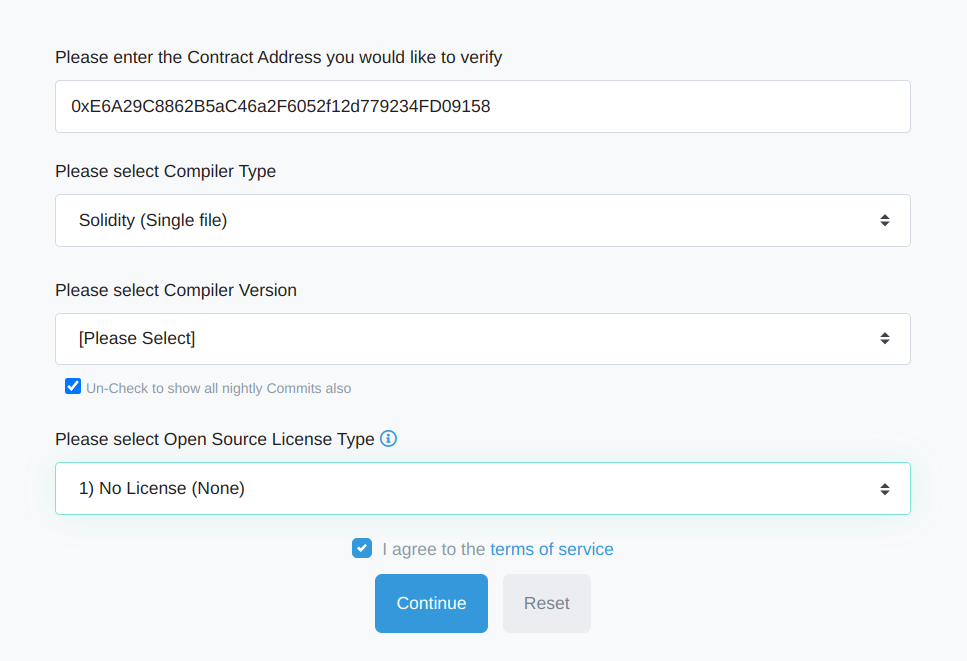
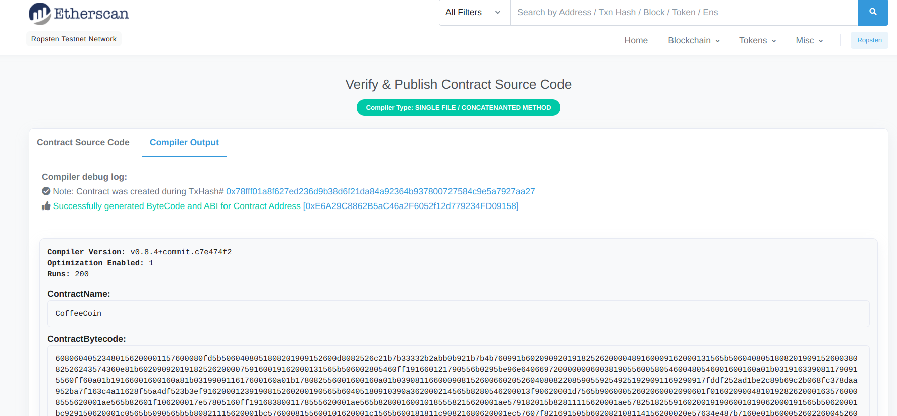

# CoffeeWarCoin
ERC20 Token CoffeeWarCoinV5 Deploy Environment

### 1. Tests Coverage
```
Brownie v1.14.6 - Python development framework for Ethereum

================================================================================= test session starts =================================================================================
platform linux -- Python 3.8.5, pytest-6.2.3, py-1.10.0, pluggy-0.13.1
rootdir: /home/anodev/projects/python/CoffeeWarCoinV5
plugins: eth-brownie-1.14.6, xdist-1.34.0, hypothesis-6.10.0, forked-1.3.0, web3-5.18.0
collected 15 items                                                                                                                                                                    

Launching 'ganache-cli --port 8545 --gasLimit 12000000 --accounts 10 --hardfork istanbul --mnemonic brownie'...

tests/test_coffeecoin.py .............                                                                                                                                          [ 86%]
tests/test_ico.py ..                                                                                                                                                            [100%]
====================================================================================== Coverage =======================================================================================


  contract: CoffeeCoin - 100.0%
    CoffeeCoin.allowance - 100.0%
    CoffeeCoin.approve - 100.0%
    CoffeeCoin.balanceOf - 100.0%
    CoffeeCoin.burn - 100.0%
    CoffeeCoin.decimals - 100.0%
    CoffeeCoin.frozeTransactions - 100.0%
    CoffeeCoin.mint - 100.0%
    CoffeeCoin.name - 100.0%
    CoffeeCoin.safeAdd - 100.0%
    CoffeeCoin.safeSub - 100.0%
    CoffeeCoin.setICOContractAddress - 100.0%
    CoffeeCoin.symbol - 100.0%
    CoffeeCoin.totalSupply - 100.0%
    CoffeeCoin.transfer - 100.0%
    CoffeeCoin.transferFrom - 100.0%

  contract: CoffeeICO - 100.0%
    CoffeeICO.closeICO - 100.0%
    CoffeeICO.contribute - 100.0%
    CoffeeICO.safeAdd - 100.0%

Coverage report saved at /home/anodev/projects/python/CoffeeWarCoinV5/reports/coverage.json
View the report using the Brownie GUI
================================================================================= 15 passed in 8.61s ==================================================================================
Terminating local RPC client...

```
### 2. [CI/CD File (Github Actions) with Deploy and Testing](./.github/workflows/ci.yml)
### 3. [Scripts for deploying contract and ICO](./scripts/)
### 4. [CI/CD File (Github Actions) with Deploy and Testing](./.github/workflows/ci.yml)
### 5. CoffeeCoin contract address on Ropsten blockchain
```
Brownie v1.14.6 - Python development framework for Ethereum

CoffeewarcoinvProject is the active project.

Running 'scripts/deploy_token_and_ICO.py::main'...
Transaction sent: 0x78fff01a8f627ed236d9b38d6f21da84a92364b937800727584c9e5a7927aa27
  Gas price: 5.0 gwei   Gas limit: 8000000   Nonce: 0
  CoffeeCoin.constructor confirmed - Block: 10289431   Gas used: 1065230 (13.32%)
  CoffeeCoin deployed at: 0xE6A29C8862B5aC46a2F6052f12d779234FD09158

Transaction sent: 0x83cf8a634c4440d7e4a192ec827c08fa68d9cba093d6bd18331d04f8fe4954ca
  Gas price: 5.0 gwei   Gas limit: 544413   Nonce: 1
  CoffeeICO.constructor confirmed - Block: 10289432   Gas used: 494921 (90.91%)
  CoffeeICO deployed at: 0xc08893C76c925da171d91600cF831c7FC951d8C8

Transaction sent: 0x518b5b82e77024c5dfce26a86aa19d09c774ffa87b841e9a013543889e6ba087
  Gas price: 5.0 gwei   Gas limit: 31897   Nonce: 2
  CoffeeCoin.setICOContractAddress confirmed - Block: 10289435   Gas used: 28998 (90.91%)

```
### 6. CoffeeCoin check on Ropsten EtherScan



